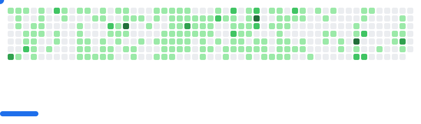

  <picture>
    <source media="(prefers-color-scheme: dark)" srcset="images/breakout-dark.svg" />
    <source media="(prefers-color-scheme: light)" srcset="images/breakout-light.svg" />
    
  </picture>

  

---

## 🎯 What I ship

I build backend systems and on-chain programs — Rust and Go on the backend, Solana on-chain.
Winner of 6 hackathons including **Paris Blockchain Week 2025 (BizThon × Solana Foundation)**
and the **Reclaim Protocol track at Solana Radar**. Grant recipient from **Superteam India**.
Maker of [**solstudio.fun**](https://solstudio.fun) — a visual IDE for Solana program development.

| Project | What it is | Stack |
|---|---|---|
| [**SolStudio**](https://github.com/skartik-sk/solflow) · [live](https://solstudio.fun) | Visual IDE for building & deploying Solana programs | TypeScript · Rust · Anchor |
| [**Vocal**](https://github.com/skartik-sk/vocal) | 100% local on-device macOS TTS, MCP-compatible | Rust · Swift · MLX |
| [**Dashh**](https://github.com/skartik-sk/blinks-mini) | Decentralized influencer marketing via zkTLS — 🥇 PBW 2025 | TypeScript · Solana Actions |
| [**ShadowBook**](https://github.com/skartik-sk/Q1_26_Accel_ShadowBook) | Ephemeral-rollup DEX (Superteam Accel) | Rust · MagicBlock |
| [**pinocchio_programs**](https://github.com/skartik-sk/pinocchio_programs) | Zero-copy, compute-efficient on-chain programs | Rust · Pinocchio |
| [**apna-hostal**](https://github.com/skartik-sk/apnahostalrgpv) | Hostel management system — app + Go API + admin web | Go · Flutter · Postgres |
| [**my-health**](https://github.com/skartik-sk/my-health) | Health super-app — records, reminders, reports in one place | React Native · TypeScript |

---

## 🛠 Stack

**Languages:** Rust · Golang · TypeScript · JavaScript · Swift · Dart

**Blockchain:** Solana · Anchor · Pinocchio · zkTLS · Blinks/Actions · Solidity

**Backend & Web:** Node.js · Next.js · React · React Native · PostgreSQL · Docker

**Tooling:** Git · Linux · Redis · gRPC · Vercel

---

## 🏆 Wins

- 🥇 **BizThon × Paris Blockchain Week 2025** (Solana Foundation) — 1st place
- 🥇 **Solana Radar Hackathon** — Reclaim Protocol track — Winner
- 🥇 **EthIndia 2024** — Okto by CoinDCX — Winner
- 🥈 **Camp Network Hackathon** — 2nd place
- 💵 **Superteam India** — Grant recipient
- 🏅 **Ace-Hack 2023** — Top 20 / 300+ teams

---

## 🎓 Programs & Certifications

- **School of Solana** — Season 7 (Ackee),completed
- **Turbin3** — Q1 2026 cohort, completed
- **Rektoff** — Rust Security Bootcamp, Cohort 5 — completed
- **SuperteamIN Superdev** — completed
- **Turbin3(Pinocchio Working Group)** — Working

---

## 📊 GitHub Stats

  
  
  

---

## 🤝 Let's Connect

  
  
  

  

  

